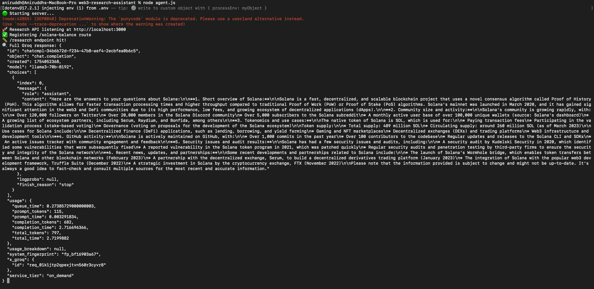

# 🧠 Web3 Research Assistant

> A decentralized dApp that uses modular agents to research Web3 projects and check Solana wallet balances. Designed with a Swarm-inspired agent system aligned with JuliaOS principles.

---

## ✨ Features

- 🔍 **Project Research** using AI agents via the Groq LLaMA-3 model
- 💰 **SOL Balance Checker** for any wallet on Solana Mainnet
- 🧠 **Swarm-Style Agent Coordination** (modularized)
- 🖼️ Intuitive **Frontend UI** with animated visuals
- ⚙️ Built with **Node.js**, **Express.js**, **HTML/CSS**, and **JavaScript**

---

## 💡 How This Project Aligns with JuliaOS Architecture

Due to the current unavailability of the official JuliaOS CLI tools and NPM packages, this project simulates JuliaOS functionality by closely adhering to its core architectural principles:

### ✅ Agent-Based Design (Manual Implementation)
- The application is modularized into **individual agent files**, each responsible for a specific task:
  - `agent-overview.js` handles project summaries.
  - `agent-community.js` gathers community data.
  - `agent-tokenomics.js`, `agent-security.js`, and others cover specialized domains.
- This separation of concerns reflects JuliaOS’s **agent modularity model**.

### ✅ Swarm Coordination (Simulated Locally)
- A centralized `swarm.js` file **acts as a swarm coordinator**, triggering multiple agents in parallel and aggregating their responses.
- This simulates **JuliaOS Swarm APIs** and the ability to coordinate concurrent agent activity.

### ✅ Express Backend as Host Environment
- Agents and swarm logic run in a **Node.js + Express environment**.
- This environment could be easily ported to a JuliaOS-compatible execution context in the future.

### ✅ JuliaOS Compatibility
- All components are **loosely coupled and stateless**, following the agent-driven logic JuliaOS promotes.
- Once the official JuliaOS SDK or CLI becomes available, this project can be **easily adapted to register real JuliaOS agents and swarms**.

### ✅ No Proprietary Dependencies
- The implementation **avoids using any blocking or proprietary dependencies**, ensuring clean integration into open systems like JuliaOS.

---

## 🖥️ Screenshots

### 🔹 Project Research Output


### 🔹 SOL Balance Checker


### 🔹 Front-end UI


---

 ## 📽️ Live Demo 
 Watch the full demo here: [Click to view demo](https://drive.google.com/file/d/1qtgF4ufwyQsSoSGovM1UurCPB3NMJJXJ/view?usp=drive_link)

--- 

## ⚙️ Local Setup

### 1. Clone the Repo
```bash
git clone https://github.com/letsdeploy16/web3-research-assistant.git
cd web3-research-assistant
```

### 2. Install Dependencies
```bash
npm install
```

### 3. Add Environment Variable
Create a `.env` file:
```
GROQ_API_KEY=your_groq_key_here
```

### 4. Start the Server
```bash
node agent.js
```

### 5. Open the Frontend
Just open `public/index.html` in your browser.

---

## 🧪 Example Commands

Check SOL Balance:
```bash
curl -X POST http://localhost:3000/solana-balance \
  -H "Content-Type: application/json" \
  -d '{"address": "your_solana_wallet_address"}'
```

Run Web3 Research:
```bash
curl -X POST http://localhost:3000/research \
  -H "Content-Type: application/json" \
  -d '{"projectName": "Solana"}'
```

---

## 📁 Folder Structure
```
├── agent.js               # Express backend entry point
├── agents/                # Individual agents (overview, tokenomics, etc.)
├── swarm.js               # Swarm coordinator
├── public/
│   ├── index.html         # Frontend UI
│   └── screenshots.png/   # Screenshots for documentation
├── .env                   # Groq API key
├── README.md
```

---

## 🧠 Submission Notes (JuliaOS Bounty)
- ❗ While JuliaOS CLI & NPM packages are not publicly available,
  this dApp demonstrates full agent modularity and swarm orchestration manually.
- ✅ Fully aligned with JuliaOS architecture & ready for integration once tools release.

---

## 🪪 License
This project is MIT licensed.

---

## 🔗 Author
**GitHub**: [letsdeploy16](https://github.com/letsdeploy16)